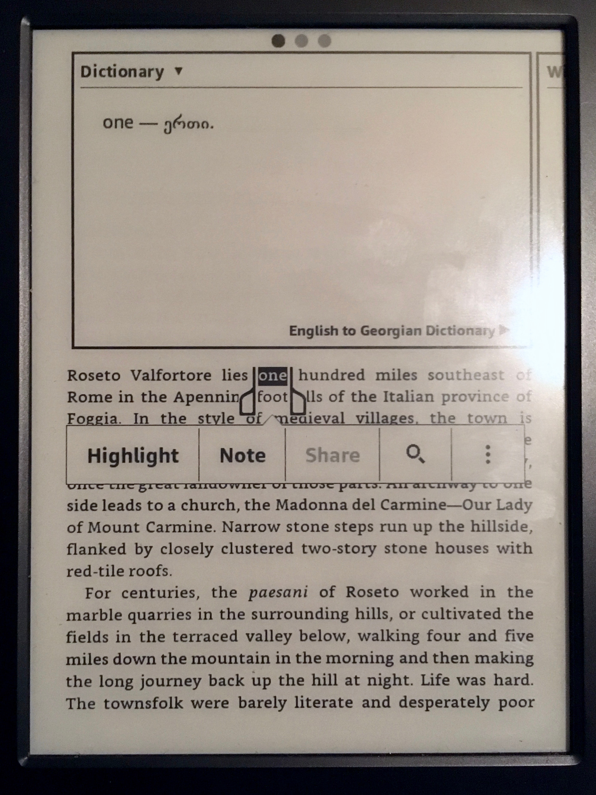

# English To Georgian Dictionary for Kindle e-readers

## Admin Panel

Basic Crud operations on words database

You can view/add/edit/delete words from database


<p align="center"> 

</p>

### Installation
Download Repository and cd into it

Install dependencies
```bash
npm i
```

run server by running command
```bash
npm run server
```

run admin panel by running command
```bash
npm run admin
```

### Generating Dictionary

Words are store into `words.sqlite` file

Firstly, we must be generate `dict.html` file from words database to create kinlde dictionary

to do this, run this command 

```bash
npm run generate
```
This command will generate `dict.html` from `words.sqlite` databse

After this, download KindleGen to generate `.mobi` -> dictionary file from `dict.html` and `dict.opf` files

Unzip and cd into kindlegen folder.

Download repository and extract it to ```~/Desktop/dict/```

to generate dictionary file run this command
```bash
/Users/ADMIN/Desktop/kindlegen/kindlegen ~/Desktop/dict/dict.opf
```

After this, you should see `dict.mobi` file inside repository file
```file
 ~/Desktop/dict/dict.mobi
```

Thats it! 

### Install on Kindle
Just copy `dict.mobi` file to your Kindle's dictionary folder


## Contributing

Contributions are more than welcome!

Help this project to collect free translations for anyone 