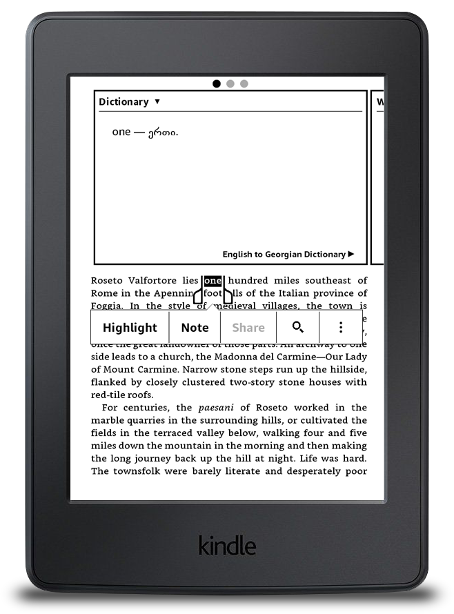
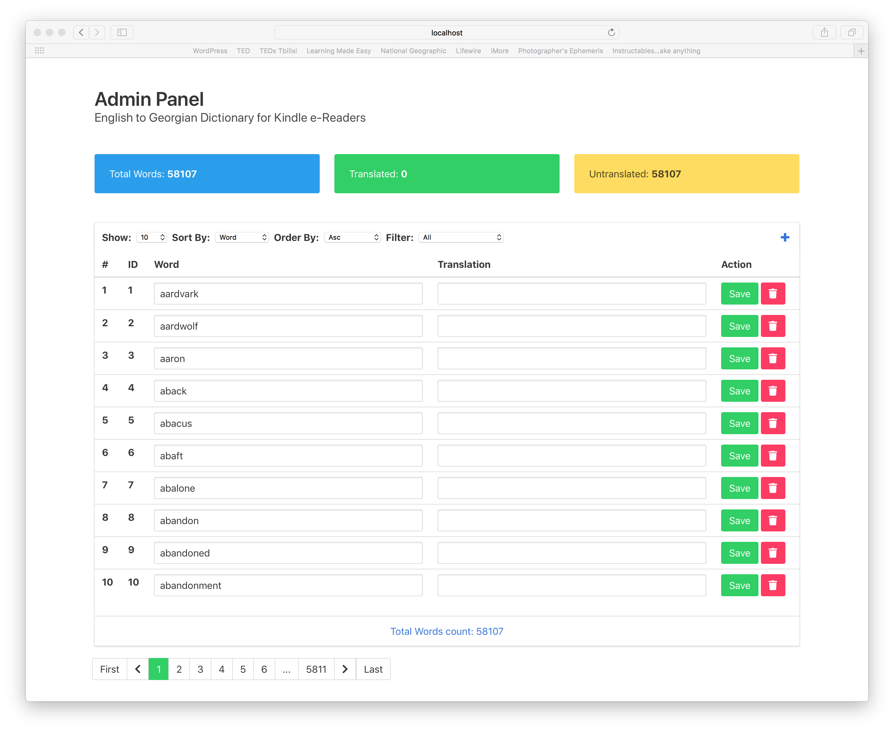

# English to Georgian Dictionary for Kindle e-Readers
To get dictionary go to the Releases tab and download `dict.mobi` file.

Current State:

```
Total Words: [58107] Translated: [40533] Untranslated: [17574]
```

<p align="center"> 

</p>

## Admin Panel

Basic Crud operations on words database

You can view/add/edit/delete words from database



### Installation
Download Repository and cd into it

Install dependencies
```bash
npm i
```

run server by running command
```bash
npm run server
```

run admin panel by running command
```bash
npm run admin
```

### Translation

`crawler/google.js` is service, which translates words without translations in the DB from google translate api

run crawler

```bash
npm run crawler:google 10
```

You can pass argument like `10`, and crawler will translate same amount of words at one time

### Generating Dictionary

Words are store into `words.sqlite` file

Firstly, we must generate `dict.html` file from words database to create kinlde dictionary

to do this, run this command 

```bash
npm run generate
```
This command will generate `dict.html` from `words.sqlite` databse

After this, download [KindleGen](https://www.amazon.com/gp/feature.html?docId=1000765211)
 to generate `.mobi` dictionary file from `dict.html` and `dict.opf` files

Unzip and cd into kindlegen folder.

Download repository and extract it to ```~/Desktop/dict/```

to generate dictionary file run this command
```bash
/Users/ADMIN/Desktop/kindlegen/kindlegen ~/Desktop/dict/dict.opf
```

After this, you should see `dict.mobi` file inside repository file
```file
 ~/Desktop/dict/dict.mobi
```

Thats it! 

### Install on Kindle
Just copy `dict.mobi` file to your Kindle's dictionary folder


## Contributing

Contributions are more than welcome!

Help this project to collect free translations for anyone 
